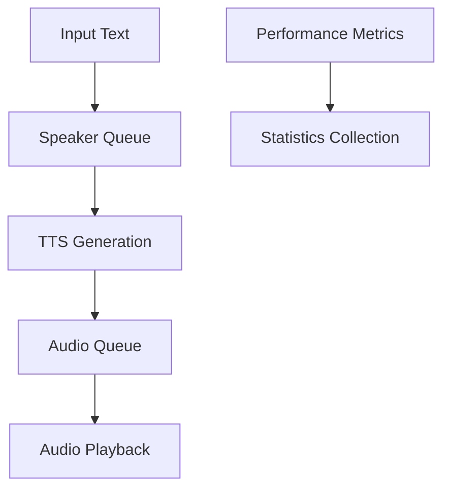

# Real-Time Dialogue System Overview

## System Architecture

### Core Components
1. **DynamicDialogueSystem**
   - Central orchestrator managing dialogue flow
   - Handles speaker queuing and timing
   - Manages audio generation and playback

2. **Text-to-Speech (TTS) Pipeline**
   - ONNX-based inference
   - Voice selection and processing
   - Audio generation optimization

3. **Audio Management**
   - Queue-based audio playback
   - Real-time audio streaming
   - Thread-safe operations

### Data Flow

## Key Features
- Real-time audio generation and playback
- Dynamic speaker management
- Performance monitoring and optimization
- Thread-safe operations
- GPU-accelerated inference

## Performance Characteristics
- Generation time: 0.9-1.6s for typical messages
- Audio playback: Real-time with no artificial delays
- Latency: Natural timing based on processing speed
- Memory usage: Optimized for continuous operation
- GPU utilization: Efficient spikes during generation
